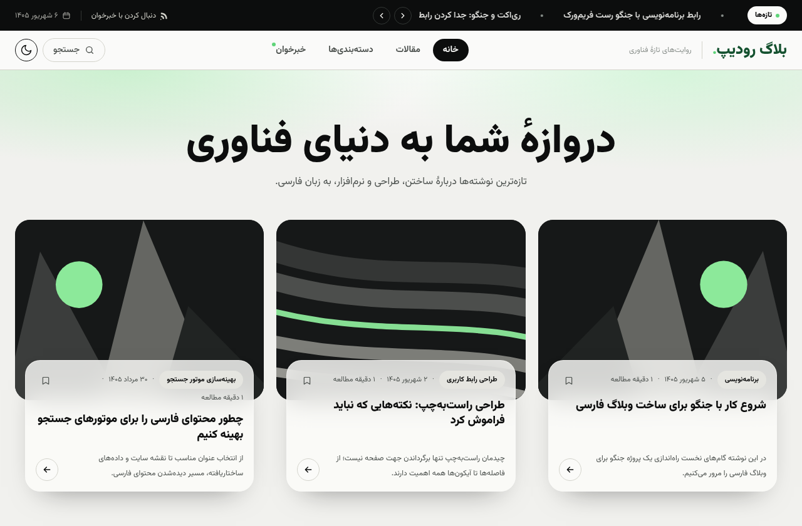
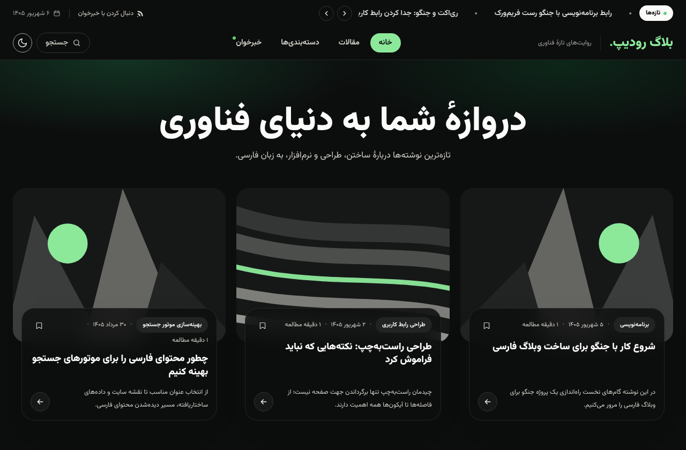
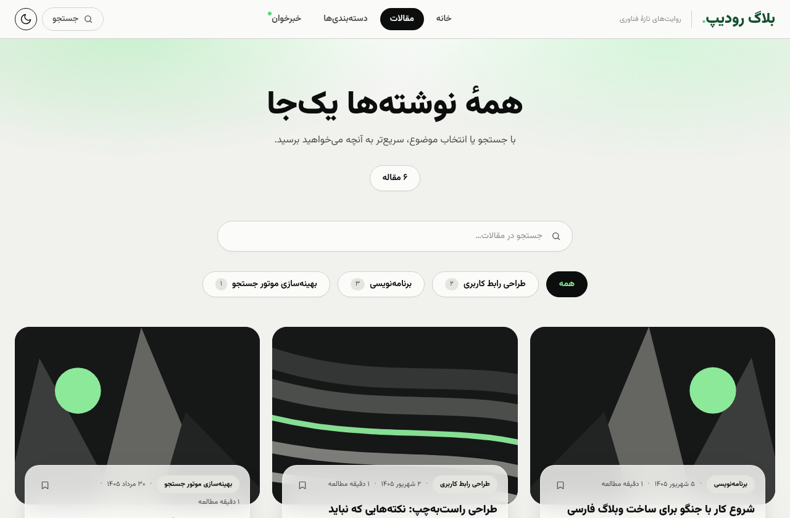
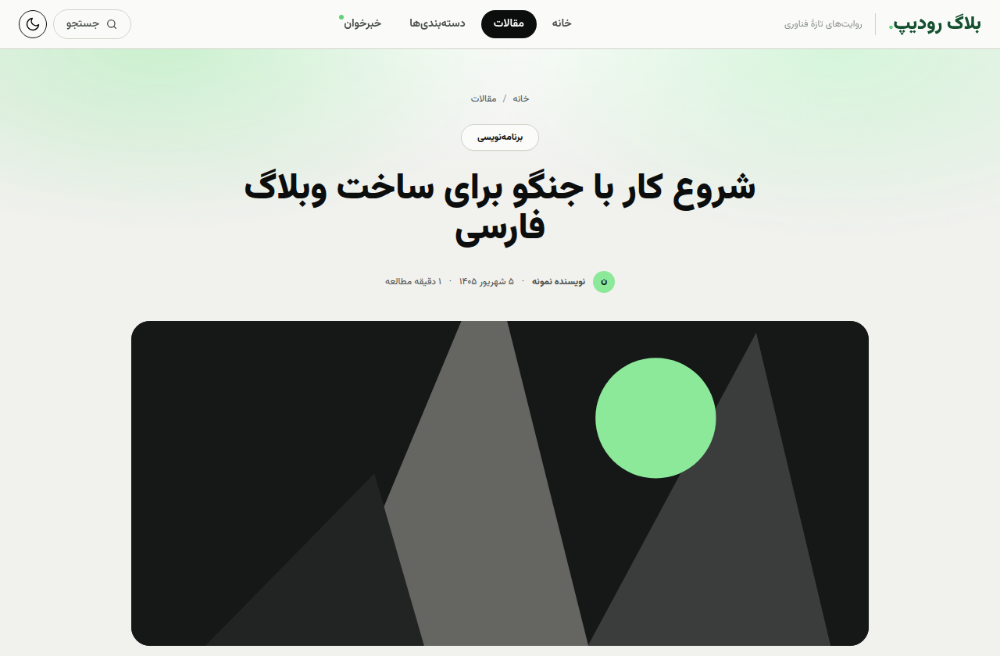
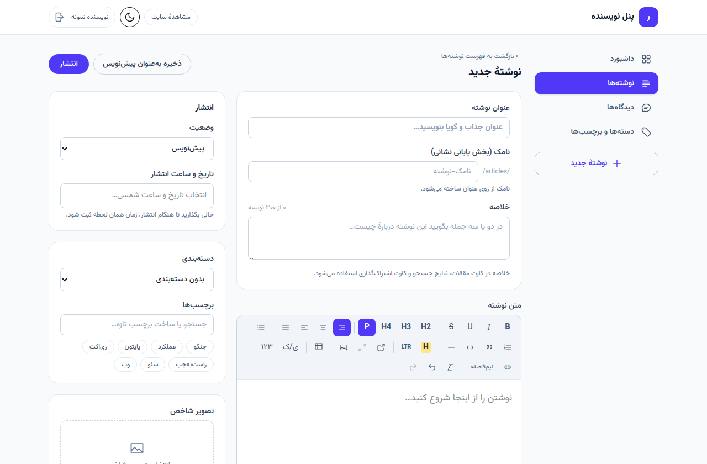

<div dir="rtl">

# بلاگ رودیپ

وبسایت بلاگ فارسی و راست‌چین با فرانت‌اند **React + Tailwind** و بک‌اند **Django REST** — همراه با پنل نویسندگی داخلی، ادیتور فارسی، تقویم جلالی و زیرساخت کامل سئو.

**🌐 نسخهٔ نمایشی زنده:** <https://damyarpro.github.io/blogroadeep/>

## نمایی از سایت

| صفحهٔ اصلی (روشن) | صفحهٔ اصلی (تاریک) |
|---|---|
|  |  |

| فهرست مقالات | صفحهٔ مقاله |
|---|---|
|  |  |

**ادیتور فارسی پنل نویسندگی** — تراز متن، هایلایت، جدول، ابزارهای مخصوص فارسی (نیم‌فاصله، تبدیل ارقام، گیومه) و تقویم جلالی:



## امکانات

- صفحهٔ اصلی مجله‌ای، فهرست مقالات با جستجوی زنده و فیلتر دسته‌بندی و صفحه‌بندی همگام با URL، صفحهٔ مقاله، دسته‌بندی‌ها — همگی فارسی و راست‌چین با فونت وزیرمتن و حالت تاریک
- **سئو**: متا و Open Graph و لینک canonical برای هر صفحه، دادهٔ ساخت‌یافتهٔ `BlogPosting`، و `sitemap.xml` و `robots.txt` و فید RSS از سمت جنگو
- مقالات با دسته‌بندی، برچسب، تصویر شاخص، زمان مطالعه و فیلدهای سئوی اختصاصی (متا تایتل/دیسکریپشن/کلمات کلیدی/canonical)
- **پنل نویسندگی داخلی** در مسیر `‎/admin` (ورود توکنی، مخصوص نویسنده): داشبورد، مدیریت نوشته‌ها، ادیتور غنی Tiptap با آپلود تصویر داخل متن، پنل سئو با پیش‌نمایش زندهٔ گوگل و چک‌لیست، ذخیرهٔ خودکار، مدیریت دیدگاه‌ها با تأیید گروهی، و مدیریت دسته و برچسب
- دیدگاه‌ها با صف تأیید (تا تأیید نشوند نمایش داده نمی‌شوند)
- پاک‌سازی HTML سمت سرور با `nh3` در هر ذخیره، تا هیچ محتوای ناامنی به صفحهٔ مقاله نرسد

## اجرای پروژه

**بک‌اند** (روی <http://127.0.0.1:8000>):

<div dir="ltr">

```bash
cd backend
pip install -r requirements.txt
python manage.py migrate
python manage.py seed_blog     # دادهٔ نمونهٔ فارسی؛ با ‎--flush ریست می‌شود
python manage.py runserver
```

</div>

**فرانت‌اند** (روی <http://localhost:5173>):

<div dir="ltr">

```bash
cd frontend
npm install
cp .env.example .env
npm run dev
```

</div>

### ورود به پنل نویسندگی

دستور `seed_blog` یک نویسندهٔ نمونه می‌سازد: نام کاربری `demo_author` و رمز `demo12345`. وارد <http://localhost:5173/login> شوید؛ لینک پنل در هدر سایت ظاهر می‌شود. پنل به بک‌اند جنگو نیاز دارد — نسخهٔ نمایشی گیت‌هاب پیجز به‌جای آن پیام راهنما نشان می‌دهد.

## تست‌ها

<div dir="ltr">

```bash
cd backend && python manage.py test    # API، سئو، دیدگاه‌ها و پنل
cd frontend && npm run build           # بررسی تایپ‌ها و بیلد
```

</div>

## مستندات

- [`docs/BACKEND_BRIEF.md`](docs/BACKEND_BRIEF.md) — بریف ساخت بک‌اند مستقل بر اساس قرارداد API
- [`docs/BLOG_INTEGRATION_BRIEF.md`](docs/BLOG_INTEGRATION_BRIEF.md) — بریف افزودن این بلاگ به یک وبسایت موجود
- [`frontend/README.md`](frontend/README.md) — جزئیات فرانت، حالت دموی استاتیک و بازسازی اسنپ‌شات

## مجوز

MIT

</div>
